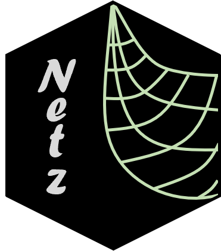

<!-- README.md is generated from README.Rmd. Please edit that file -->

```{r, include = FALSE}
knitr::opts_chunk$set(
  collapse = TRUE,
  comment = "#>"
)
```

# netz 

<!-- badges: start -->
[](https://www.repostatus.org/#wip)
[](https://github.com/mrc-ide/netz/actions)
[](https://codecov.io/github/mrc-ide/netz)
<!-- badges: end -->

Netz is here to help setup bed nets in [malariasimulation](https://mrc-ide.github.io/malariasimulation/)


