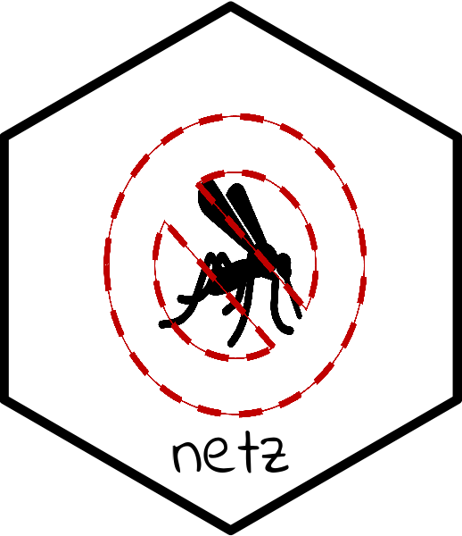
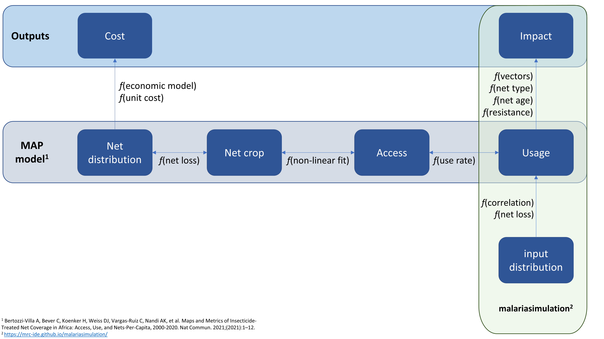

<!-- README.md is generated from README.Rmd. Please edit that file -->

# netz 

<!-- badges: start -->

<!-- badges: end -->

Netz is here to help setup bed nets in
[malariasimulation](https://mrc-ide.github.io/malariasimulation/).

Much of the functionality within this package is based on the excellent
bed net model by [Bertozzi-Villa, Amelia, et al. Nature communications
12.1 (2021): 1-12](https://www.nature.com/articles/s41467-021-23707-7).

One of the key features of the netz package is to help conversions
between the different measure of net coverage and net numbers. These are
defined as:

-   **Usage**: The proportion of the population with access to a net who
    slept under it.

-   **Access**: The proportion of the population who live in a household
    where they could sleep under a bed net.

-   **Crop**: The number of nets in the population. Always expressed as
    nets per capita.

-   **Distribution**: The number of nets distributed. Always expressed
    as nets per capita per year.

