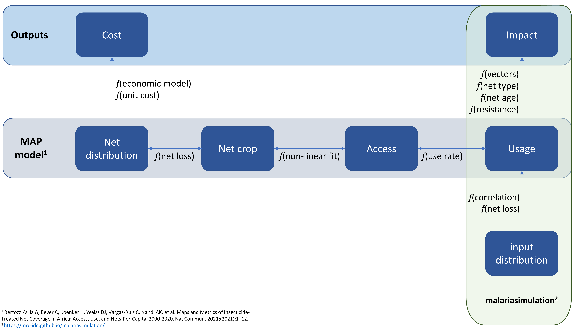

# netz 

Netz is here to help setup bed nets in
[malariasimulation](https://mrc-ide.github.io/malariasimulation/).

Much of the functionality within this package is based on the excellent
bed net model by [Bertozzi-Villa, Amelia, et al. Nature communications
12.1 (2021): 1-12](https://www.nature.com/articles/s41467-021-23707-7),
please check it out and make sure to cite appropriately if you use this
package.

One of the key features of the netz package is to help conversions
between the different metrics of net coverage and net numbers. These are
defined throughout as:

- **Usage**: The proportion of the population with a net who slept under
  it.

- **Access**: The proportion of the population who live in a household
  where they could sleep under a bed net.

- **Crop**: The number of nets in the population. Always expressed as
  nets per capita.

- **Distribution**: The number of nets distributed. Always expressed as
  nets per capita per year.

Broadly, distribution will relate to the cost of the programme and usage
the impact.

Not all of the metrics above are modelled within
[malariasimulation](https://mrc-ide.github.io/malariasimulation/). We
therefore need to be careful that out model inputs match our desired
target usage when specifying bed nets. The schematic below will help in
understanding how each of these elements relate to one another

